% CS 530 HMWK 3
% Alex Hagen
% November 5th, 2013

Diffusion Tensor Imaging is an exciting prospect for the understanding
of the anatomy and function of the brain. Unfortunately, while the
technology has been developed and provides good results, the
visualization of the data is a non trivial matter. It requires the
rendering at each spatial point of a matrix with 9 components (6 of
which encode unique values, as they are symmetric). This requires the
use of glyphs and hyperstreamlines, which have been used to show the
flow channels in the brain in several different tasks. Fractional
anisotropy is a way to encode these tensors into a scalar, and a volume
rendering of this has been shown along with the glyphs to provide extra
data about the brain structure.

Task 1 - Glyphs
===============

glyph rendering can be very cluttered and non intuitive. Regardless, the
use of these to explore the dataset takes advantage of their fast
rendering, the ability to move planes easily, and the ability to color
eigenvalues to determine orientation. The diffusion tensor imaging (DTI)
dataset shows some important features through the simple rendering of
glyphs. By shaping each glyph as a sphere, and using a vtkTensorGlyph
filter to shape it into an ellipsoid, and then coloring it based on the
ratios of the eigenvalues, the following images were created. Figure
[fig:Three-Plane-Rendering-of-DTI-Data-Set] shows a rendering of three
planes of interest, and their intersection.

These three planes show:

Grey Matter
:   A typical section of grey matter is shown in Figure [fig:Grey Matter
    Rendering of DTI Data Set]. You can see there is a spot of high
    isotropic diffusion at the center, which shows where the corpus
    collosum attaches to this slice of grey matter. This is surrounded
    by highly anisotropic material radiating outward until there is a
    small measure of isotropy at the surface of the brain.

Optic Chiasm
:   By slicing transversely through the data set in Figure [fig:Optic
    Chiasm Rendering of DTI Dataset], we can see a large isotropic cross
    shape. This shows the optic chiasm, where the visual signals from
    each eye are sent to the opposite side of the back of the brain to
    be processed.

Brain Stem
:   A saggital slice through the center of the brain, shown in Figure
    [fig:Brain Stem Rendering of DTI Dataset], shows how the brain stem
    drops below the rest of the brain mass. There are several areas of
    high isotropy, notably where the optic chiasm intersects this plane,
    and also where the spinal cord attaches into the brain stem. These
    are both areas of high “data transmission”, and this observation can
    be used to provide context to the presence of isotropy in the brain.

Coronal Slice
:   A coronal slice was not used to visualize this dataset in the three
    plane rendering, as it would occlude other features of the slicing.
    It is shown separately in Figure [fig:Forward Facing Rendering of
    DTI Dataset], showing again the brain stem with its relative
    isotropy.

[fig:Three-Plane-Rendering-of-DTI-Data-Set]

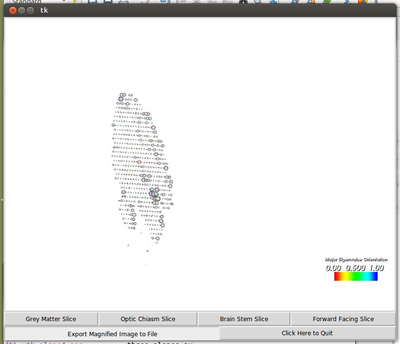[fig:Grey Matter Rendering of DTI Data
Set]

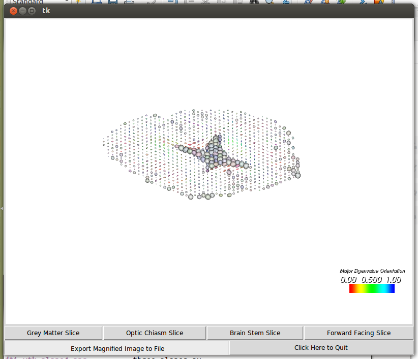[fig:Optic Chiasm Rendering of DTI
Dataset]

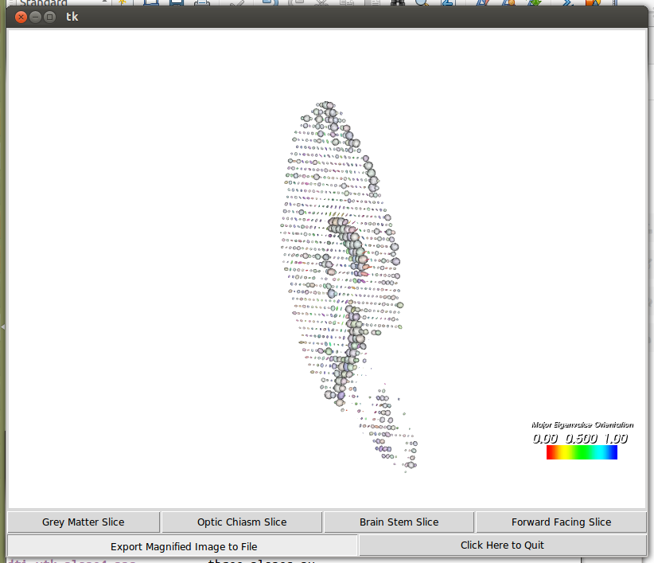[fig:Brain Stem Rendering of DTI Dataset]

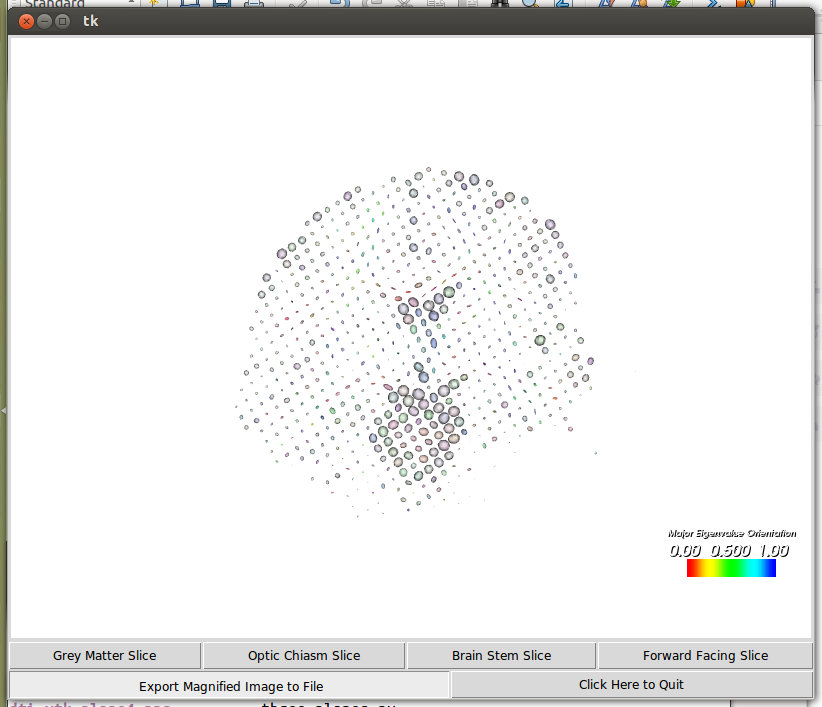[fig:Forward Facing Rendering of DTI
Dataset]

Task 2 - Volume Rendering and Fibers
====================================

provides a scalar value to encode the tensor that was visualized using
glyphs in Task 1. When volume rendering this along with tensor glyphs,
it can give an idea as to the actual structure of the brain and how that
relates to the flow channels. This data has two roughly defined
bounaries, one of the dense and isotropic parts of the brain, shown by
Figure [fig:Inner Surface of Fractional Anisotropy Dataset ], and one of
the less dense more anisotropic parts of the brain, shown by Figure
[fig:Outer Surface of Fractional Anisotropy Dataset]. A opacity transfer
function was created using these two surfaces, and an exponential
increase in opacity from the outer to the inner surface. This
unsatisfactorally shows the brain structure, and in fact showed many
artifacts when rendering. This ineffective rendering is shown in Figure
[fig:Tensor Glyphs with Volume Rendering of Fraction Inosotropy from DTI
Dataset]. A rendering of just the volume rendering of the brain is shown
in Figure [fig:Volume Rendering of Fractional Anisotropy of DTI
Dataset], which shows how the dataset does not satisfactorally show
structure to the brain.

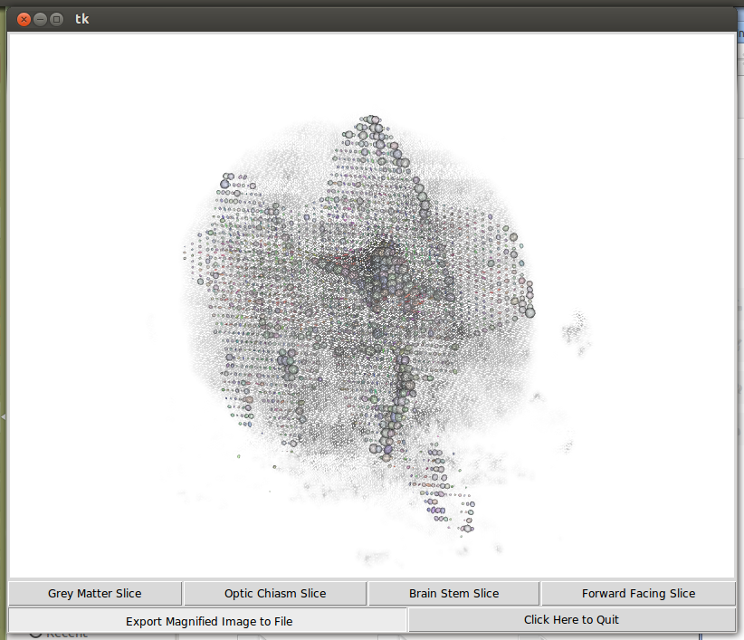[fig:Tensor Glyphs with Volume
Rendering of Fraction Inosotropy from DTI Dataset]

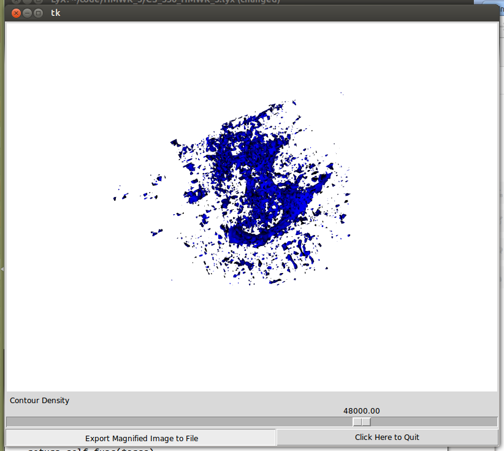[fig:Inner Surface of Fractional
Anisotropy Dataset ]

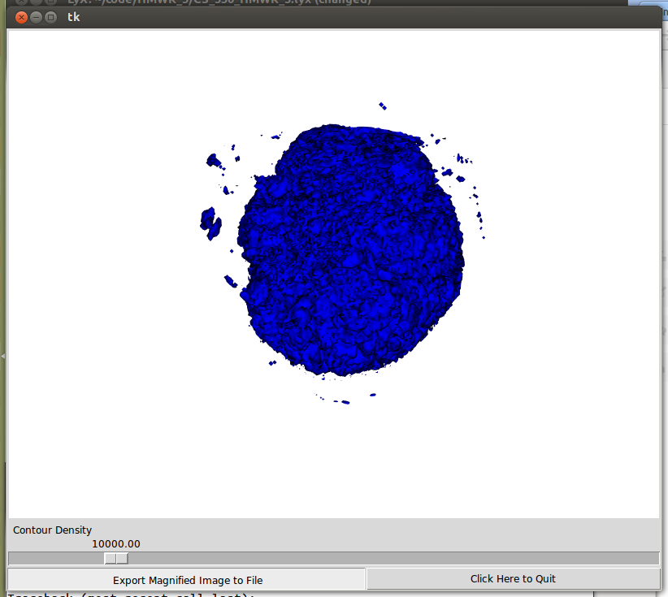[fig:Outer Surface of Fractional
Anisotropy Dataset]

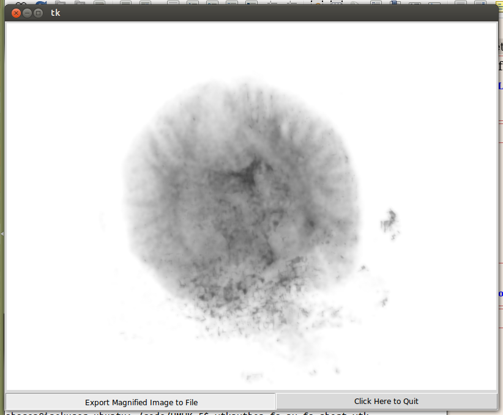[fig:Volume Rendering of
Fractional Anisotropy of DTI Dataset]

DEPRECATED - Task 2 - Hyperstreamlines
======================================

provide a good way to show channels in a tensor dataset. While the VTK
implementation of these hyperstreamlines is not ideal (a streamline
implementation that didn’t change size throughout its path would be
better), a decent quality rendering of the flow channels in a human
brain could be created using these. The seeding was done starting in a
box that surrounded the optical chiasm, with sparse spacing. This is
shown in Figure [mar:Hyperstreamline-Seeding-Diagram-1]. By increasing
the length of the streamline to see the entire path of each streamline,
the returns and folds in each streamline helps visualize practically the
entire center of the brain.

The hyperstreamlines were colored using the “effective stress” of the
tensor data given, using a vtkExtractTensorComponent filter. The
effective stress is defined by the difference of the total stress and
the pore water pressure.

$$\sigma'=\sigma_{T}-u$$ In this case, the pore water pressure is zero,
so the effective stress is exactly equal to the total stress
@Terzaghi1925. The total stress is defined as the total inward stress on
the surface. By visualizing this data, we can see that the tensors have
higher inward stress as they reach the outside of the brain, which is
also shown by the fanning of the hyperstreamline. This shows how the
channels are extremely anisotropic throughout the grey matter of the
brain, but become isotropic in two dimensions along the surface of the
brain. This provides insight into how the signals are passed throughout
the brain.

The three Figures [fig:Isometric View of Hyperstreamline Rendering of
DTI Dataset-1]-[fig:Front Brain Close up View of Hyperstreamline
Rendering of DTI Dataset-1] show several different views of the brain.
The isometric (Figure [fig:Isometric View of Hyperstreamline Rendering
of DTI Dataset-1]) and side (Figure [fig:Side View of Hyperstreamline
Rendering of DTI Dataset-1]) views given an overview of the brain
through similar perspectives. The close up (Figure [fig:Front Brain
Close up View of Hyperstreamline Rendering of DTI Dataset-1]) shows
detail of the fanning of the hyperstreamlines near the surface of the
brain. The rose petal type designs near the surface are an interesting
artifact of the hyperstreamline rendering and presumably do not
correspond to any physical “twisting” phenomena. A plane rendering of
the effective stress has been added in the form of a transverse slice to
help with visualization and placement for the viewer.

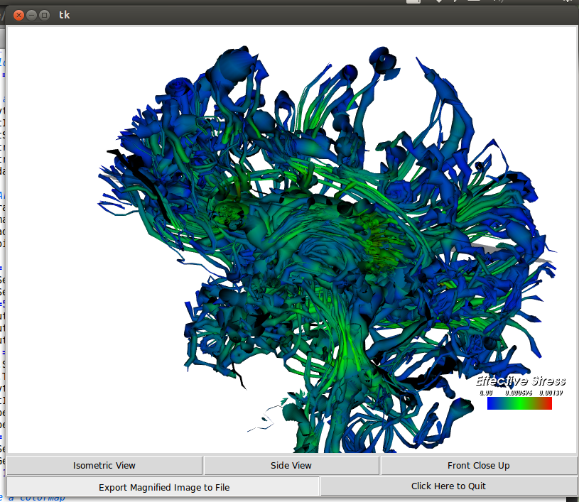[fig:Isometric View of Hyperstreamline
Rendering of DTI Dataset-1]

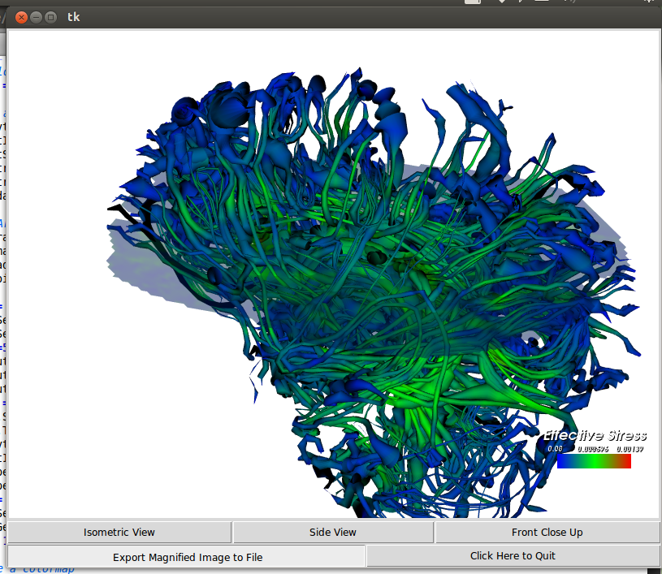[fig:Side View of Hyperstreamline
Rendering of DTI Dataset-1]

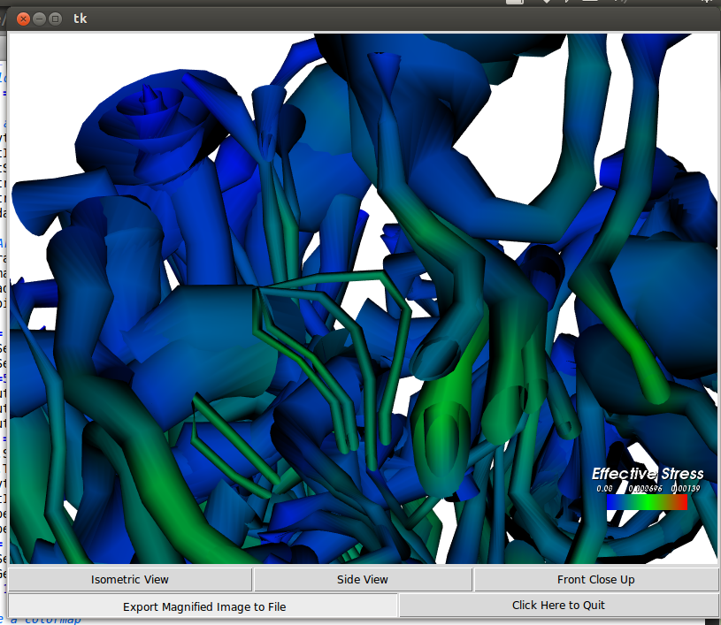[fig:Front Brain Close up View of
Hyperstreamline Rendering of DTI Dataset-1]
Updated
